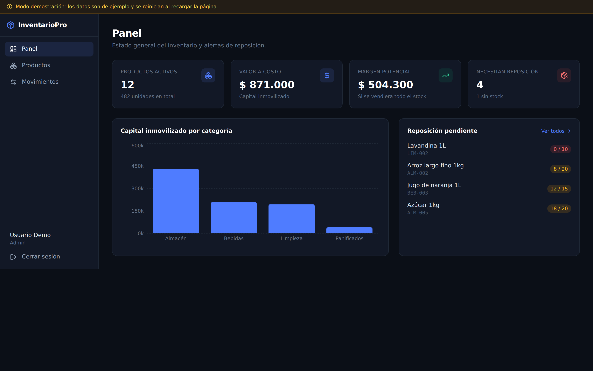
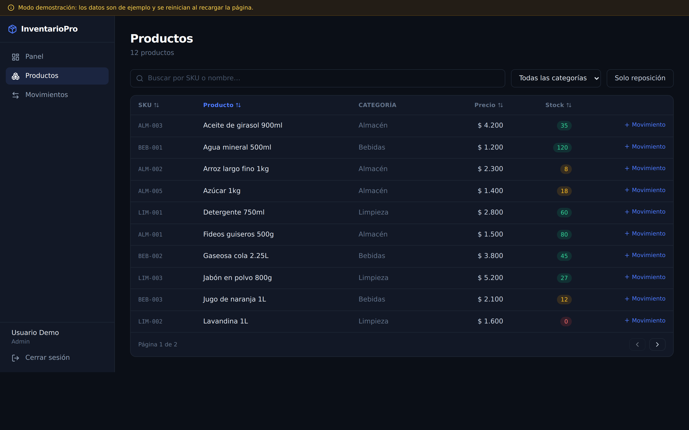
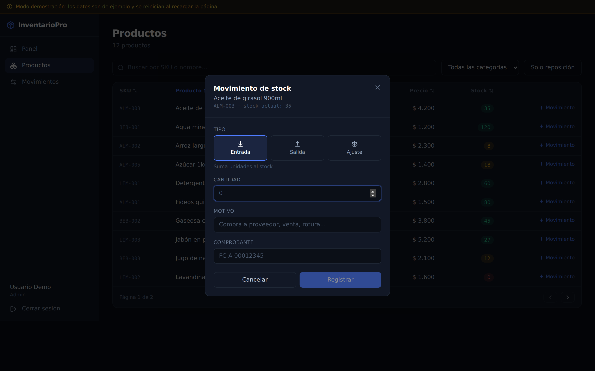
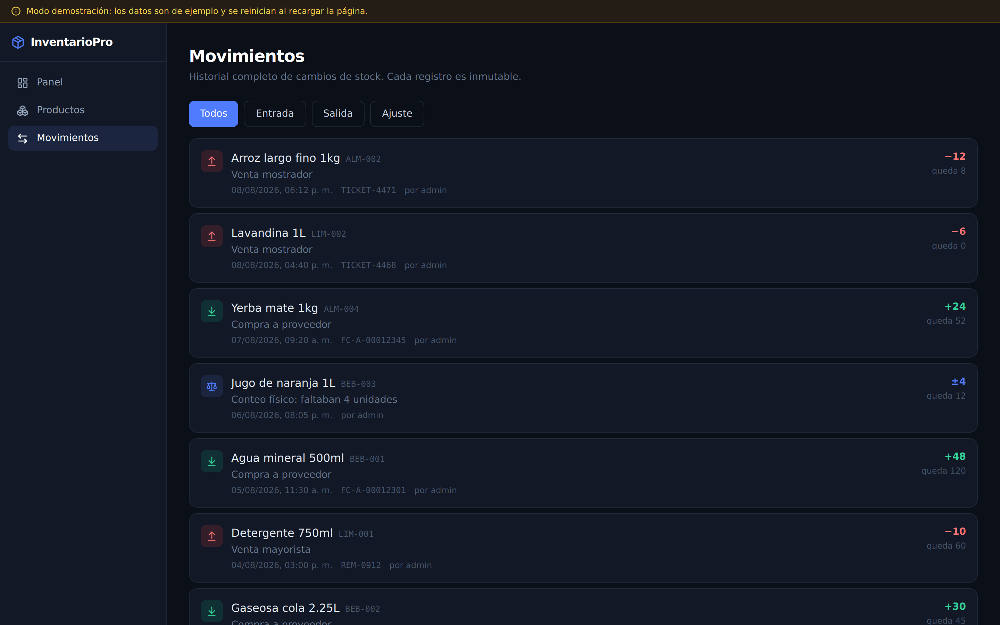

<div align="center">

# InventarioPro

**Inventory management system with full stock traceability, role-based access control and audit trail.**

.NET 9 REST API + Next.js dashboard.

[](https://dotnet.microsoft.com/)
[](https://www.postgresql.org/)
[](https://nextjs.org/)
[](https://www.typescriptlang.org/)
[](LICENSE)

</div>

---



---

## What this is

A complete rewrite of a first-year university project — originally a WinForms desktop app on .NET Framework 4.8, backed by a Microsoft Access `.mdb` file, with no authentication, no tests, and prices stored as integers.

The domain is the same (a small shop managing its stock). What changed is everything the original ignored: **who changed the stock, when, why — and what happens when two people change it at the same time.**

---

## The core design decision

In the original app, `Stock` was a column anyone could overwrite. Here it is a **derived value**.

Every change goes through a `StockMovement` — an immutable, append-only record of every entry, exit and adjustment. `Product.Stock` is a cached projection of that log, and both are written inside a single database transaction. If the transaction fails, neither is written.

```
StockMovement (source of truth)          Product.Stock (projection)
├─ In        +100  → StockAfter: 100
├─ Out        -30  → StockAfter:  70   ────────►   70
└─ Adjustment  42  → StockAfter:  42   ────────►   42
```

What follows from this:

- Stock can be **rebuilt from scratch** by replaying the movements
- Every unit traces back to a user, a timestamp and a reason
- A physical count that disagrees with the system is recorded as an `Adjustment`, not silently overwritten
- Stock can never go negative — the domain rejects it before the database is touched

The dashboard mirrors the same rule: **there is no "edit stock" field anywhere in the UI**, only a movement form.

---

## Architecture

```
┌─────────────────────────┐         ┌──────────────────────────┐
│   dashboard/            │  HTTPS  │   api/                   │
│   Next.js 15 · React 19 │ ──────► │   .NET 9 Web API         │
│   TypeScript · Tailwind │  JWT    │   EF Core 9              │
└─────────────────────────┘         └───────────┬──────────────┘
                                                │
                                    ┌───────────▼──────────────┐
                                    │   PostgreSQL 16          │
                                    │   Products · Movements   │
                                    │   Users · Refresh tokens │
                                    └──────────────────────────┘
```

The API works on its own — Swagger UI at `/swagger` exposes every endpoint. The dashboard is the human-facing layer on top of it, and can also run standalone in demo mode with in-memory data.

---

## Concurrency

Two operators shipping the same product at the same time is the classic way inventory systems corrupt themselves. Both read `Stock = 10`, both subtract 6, and the second write silently wins: the system says 4 when it should say -2.

Handled with **optimistic concurrency** using PostgreSQL's `xmin` system column as a row version. If the row changed between read and write, EF Core raises `DbUpdateConcurrencyException` and the service retries up to three times with fresh data.

```csharp
e.Property(p => p.Version).IsRowVersion().HasColumnName("xmin");
```

---

## Security

| Concern | How it's handled |
|---|---|
| SQL injection | EF Core parameterizes everything; sorting uses a whitelist, never string concatenation |
| Password storage | ASP.NET Core Identity (PBKDF2), 10-char minimum with mixed character classes |
| Brute force | Account lockout after 5 failed attempts + rate limiting of 8 req/min on auth endpoints |
| User enumeration | Login responds identically whether the email exists or the password is wrong |
| Token theft | Access tokens live 15 minutes; refresh tokens rotate on every use |
| Refresh token reuse | Stored as SHA-256 hashes. A replayed token revokes the user's entire session family |
| Mass assignment | Separate input DTOs — `Stock` and audit fields are not bindable from the request body |
| Secret leakage | No secrets in `appsettings.json`; the app refuses to start if the JWT key is missing or under 32 chars |
| Information disclosure | Unhandled exceptions return a generic `ProblemDetails`; stack traces stay server-side |
| Container | Runs as a non-root user (UID 10001) |

---

## Screens

### Products

Search, category filter, sortable columns, pagination. Stock badges are colour-coded: red at zero, amber below the reorder threshold, green above it.



### Stock movement

The form previews the resulting stock before saving and blocks an exit larger than what's available — the same rule the API enforces server-side, surfaced early so the operator doesn't hit an error after filling everything in.



### Movement history

Append-only log. Every record shows the delta, the resulting stock, the reason, the document reference and the user.



---

## Running it

### Dashboard only (no backend needed)

```bash
cd dashboard
npm install
cp .env.example .env.local     # ships with NEXT_PUBLIC_DEMO_MODE=true
npm run dev
```

Open **http://localhost:3000**. Runs on in-memory sample data, with a persistent banner making clear the data isn't real.

### Full stack

```bash
# API + database
cd api
docker compose up --build      # Swagger at http://localhost:8080/swagger

# Dashboard pointing at it
cd ../dashboard
npm install
cp .env.example .env.local
# set NEXT_PUBLIC_DEMO_MODE=false and NEXT_PUBLIC_API_URL=http://localhost:8080
npm run dev
```

### API without Docker

```bash
cd api/src/InventarioPro.Api

dotnet user-secrets set "Jwt:Key" "$(openssl rand -base64 48)"
dotnet user-secrets set "Seed:AdminEmail" "admin@inventariopro.local"
dotnet user-secrets set "Seed:AdminPassword" "Admin#Local2026"

dotnet ef migrations add InitialCreate
dotnet ef database update
dotnet run
```

### Tests

```bash
cd api
dotnet test
```

Nine tests covering the stock invariants: no negative stock, insufficient-stock rejection, adjustment arithmetic, inactive products, and history-to-stock consistency. They run on an in-memory provider — no database required.

---

## API reference

All endpoints require a bearer token except `/api/auth/*` and `/health`.

| Method | Endpoint | Role |
|---|---|---|
| `POST` | `/api/auth/register` · `login` · `refresh` · `logout` | — |
| `GET` | `/api/products` | any |
| `POST` `PUT` | `/api/products` | Admin, Manager |
| `DELETE` | `/api/products/{id}` | Admin |
| `GET` | `/api/stock/movements` | any |
| `POST` | `/api/stock/movements` | Admin, Manager |
| `GET` | `/api/reports/valuation` | any |
| `GET` | `/api/reports/valuation/by-category` | any |
| `GET` | `/api/reports/low-stock` | any |

Products support `?search=`, `?categoryId=`, `?lowStockOnly=true`, `?minPrice=`, `?sortBy=price&desc=true`, `?page=1&pageSize=20`.

### Example — register a stock exit

```bash
curl -X POST http://localhost:8080/api/stock/movements \
  -H "Authorization: Bearer $TOKEN" \
  -H "Content-Type: application/json" \
  -d '{
    "productId": 1,
    "type": 2,
    "quantity": 5,
    "reason": "Counter sale",
    "reference": "TICKET-4471"
  }'
```

```json
{
  "id": 12,
  "productSku": "BEB-001",
  "productName": "Agua mineral 500ml",
  "type": "Out",
  "quantity": 5,
  "stockAfter": 115,
  "reference": "TICKET-4471",
  "createdAt": "2026-08-09T14:22:10.441Z"
}
```

---

## Roles

| Role | Permissions |
|---|---|
| `Viewer` | Read products, movements and reports |
| `Manager` | + create/edit products, register stock movements |
| `Admin` | + delete products and categories |

---

## Structure

```
inventario-pro/
├── api/                                    .NET 9 REST API
│   ├── src/InventarioPro.Api/
│   │   ├── Domain/         Entities and enums
│   │   ├── Data/           DbContext, soft delete, audit, seeding
│   │   ├── Services/       Token, Product, Stock
│   │   ├── Controllers/    Auth, Products, Categories, Suppliers, Stock, Reports
│   │   ├── Dtos/           Input/output contracts
│   │   ├── Validation/     FluentValidation rules
│   │   └── Common/         Paging, exceptions, global handler
│   └── tests/              xUnit suite over stock invariants
│
└── dashboard/                              Next.js 15 front-end
    ├── src/app/            login · dashboard · products · movements
    ├── src/components/     AppShell, MovementModal, DemoBanner
    └── src/lib/            API client with JWT refresh, demo fixtures, types
```

---

## What changed from the original

| | Before | Now |
|---|---|---|
| Platform | WinForms, .NET Framework 4.8 | REST API + web dashboard |
| Database | Access `.mdb` via OleDb | PostgreSQL via EF Core |
| Data access | `DataSet` + `CommandBuilder` | Typed entities, LINQ, migrations |
| Money | `int` | `decimal(18,2)` |
| Stock changes | Direct column overwrite | Immutable movement log + transaction |
| Concurrency | None | Optimistic locking with retry |
| Auth | None | Identity + JWT + roles |
| Deletion | Physical `DELETE` | Soft delete, history preserved |
| Audit | None | Who/when on every entity |
| Tests | None | 9 xUnit tests |
| Deployment | Manual `.exe` | Docker Compose |

---

## License

MIT — see [LICENSE](LICENSE).
